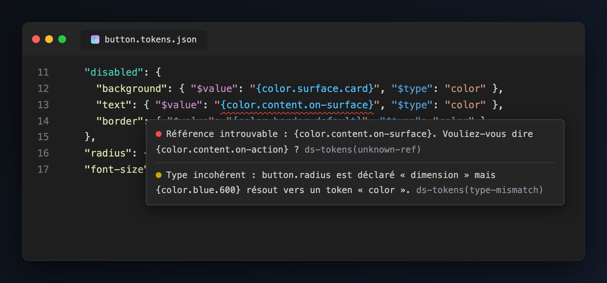
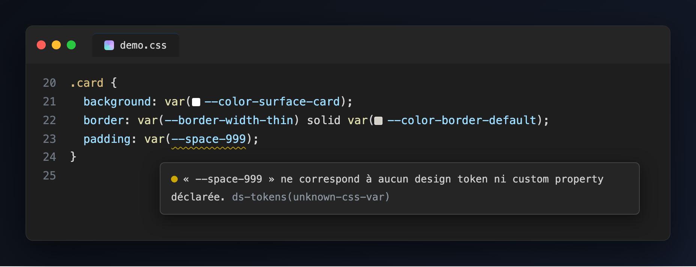
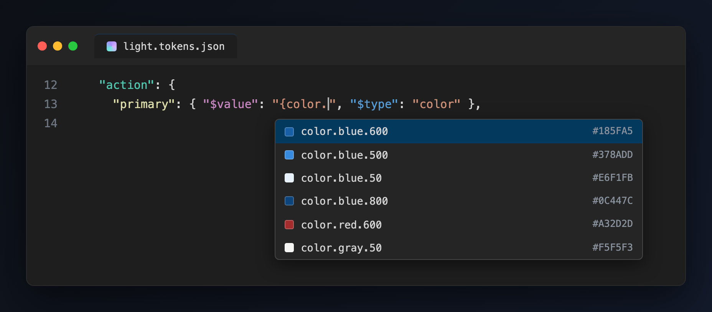
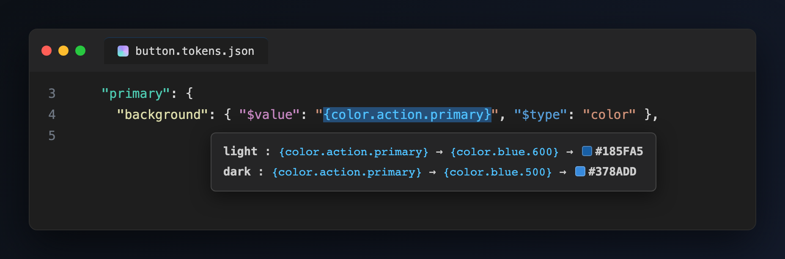
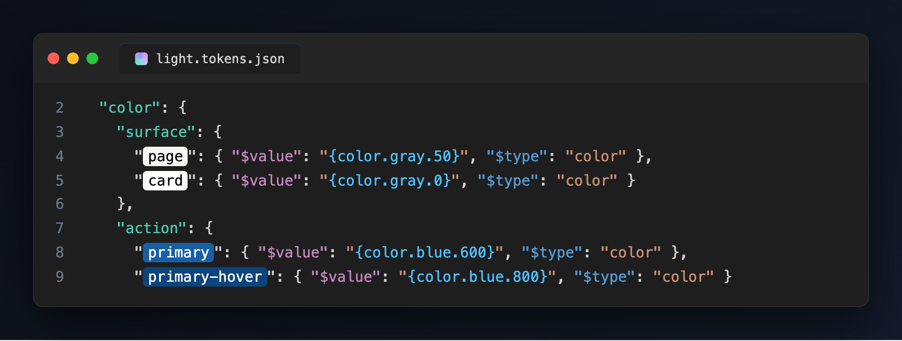

# DS Tokens IntelliSense

IntelliSense pour les design tokens au format [DTCG](https://design-tokens.github.io/community-group/format/) organisés en couches (core, semantic, component), tels que consommés par [Style Dictionary](https://styledictionary.com). L'extension attrape dans l'éditeur les erreurs que le build ne signale qu'à la fin, sans fichier ni ligne : référence morte, couleur invalide, cycle.

## Diagnostics

Dans les fichiers de tokens (`**/tokens/**/*.json`, configurable) :

| Problème | Sévérité |
| --- | --- |
| Référence introuvable `{color.content.on-surface}` (avec suggestion si un nom proche existe) | Erreur |
| Référence résolue dans un seul thème (light mais pas dark) | Warning |
| Référence circulaire (la boucle est affichée dans le message) | Erreur |
| Couleur invalide (`#18ZZZZ`) | Erreur |
| Hex court (`#1855`), valide en CSS mais hors spec DTCG | Warning |
| Alias vers un token d'un autre `$type` | Warning |

Dans les fichiers CSS (hors `build/` et `dist/`) : toute `var(--space-999)` qui ne correspond ni à un token ni à une custom property déclarée est signalée. Si aucun fichier de tokens n'a été indexé, l'extension n'a pas de vérité terrain : ces diagnostics CSS sont désactivés plutôt que de déclarer inexistante chaque `var()`.

Les diagnostics se mettent à jour pendant la frappe, sans attendre la sauvegarde.

## IntelliSense

- **Autocomplétion** des clés de tokens en tapant `{` dans un `$value`, filtrée par `$type`, avec pastilles couleur. Idem dans le CSS pour les `var(--...)` dérivées des tokens.
- **Hover** : chaîne de résolution complète par thème, par exemple `{color.action.primary}` vers `{color.blue.600}` vers `#185FA5`.
- **Go to definition** (F12, Cmd+clic) depuis un alias JSON ou une `var(--...)` CSS vers la définition du token. Les deux thèmes sont proposés pour la couche sémantique.
- **Pastilles couleur** natives sur les tokens `$type: color` (le picker ne détruit pas les alias), et décoratives sur les `var(--color-...)` en CSS.
- **Highlight** du nom des tokens couleur avec leur couleur résolue, texte en noir ou blanc selon la luminance (désactivable).
- **Coloration sémantique** de la structure DTCG : groupes, noms de tokens, clés `$value` et `$type`, alias, chacun sa teinte.

## Modèle de résolution multi-thèmes

Le modèle reflète un build Style Dictionary multi-thèmes : les couches core et component sont partagées, chaque fichier `tokens/semantic/<theme>.tokens.json` forme un ensemble de résolution par thème. Que light et dark définissent les mêmes chemins est donc normal, pas une erreur ; en revanche un token défini dans un seul thème déclenche un warning sur ses usages.

## Réglages

| Réglage | Défaut | Rôle |
| --- | --- | --- |
| `dsTokens.tokensGlob` | `**/tokens/**/*.json` | Où trouver les fichiers de tokens |
| `dsTokens.nameHighlights` | `true` | Surligner le nom des tokens couleur avec leur couleur |

## Licence

[MIT](LICENSE)
